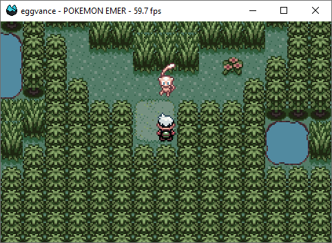

# eggvance
A Game Boy Advance emulator.

## Usage
ROM and save files can be passed as command line arguments or dropped in the emulator window. Even though the included [BIOS](https://github.com/Nebuleon/ReGBA/tree/master/bios) should be enough to run most games, it is recommended to download the original one. Its location and many other things are customizable in the [config](eggvance/eggvance.ini).

```
Usage: eggvance [--help] [--save <file>] [<rom>]
```

## Binaries
Binaries for Windows, Linux and macOS are available as [nightly](https://github.com/jsmolka/eggvance/actions) or [release](https://github.com/jsmolka/eggvance/releases) builds. Be aware that SDL2 needs to be installed on the latter two.

## Building
Detailed build instructions can be found [here](BUILDING.md).

## Credits
These projects were invaluable resources while creating the emulator:
- [GBATEK](https://problemkaputt.de/gbatek.htm) and [No$GBA](https://problemkaputt.de/gba.htm) by Martin Korth
- [NanoboyAdvance](https://github.com/fleroviux/NanoboyAdvance) by fleroviux
- [mGBA](https://github.com/mgba-emu/mgba) and [suite](https://github.com/mgba-emu/suite) by endrift
- [higan](https://github.com/higan-emu/higan) by Near
- [Tonc](https://www.coranac.com/tonc/text/toc.htm) by cearn


